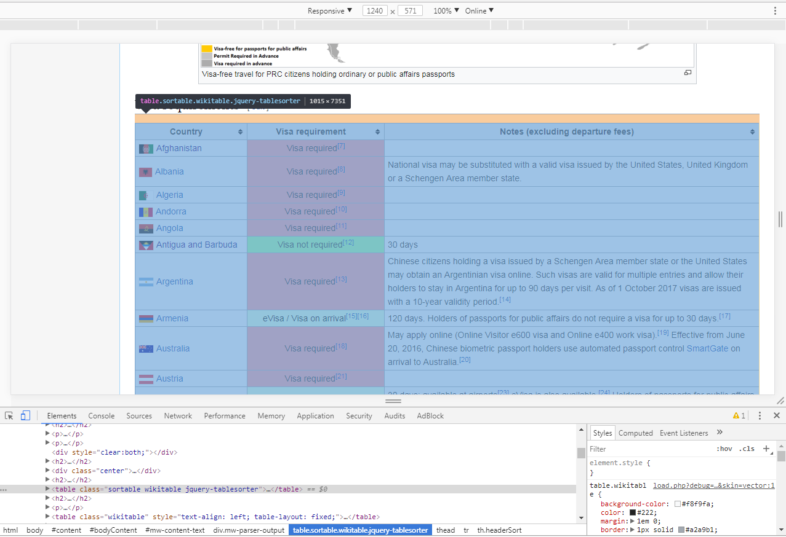
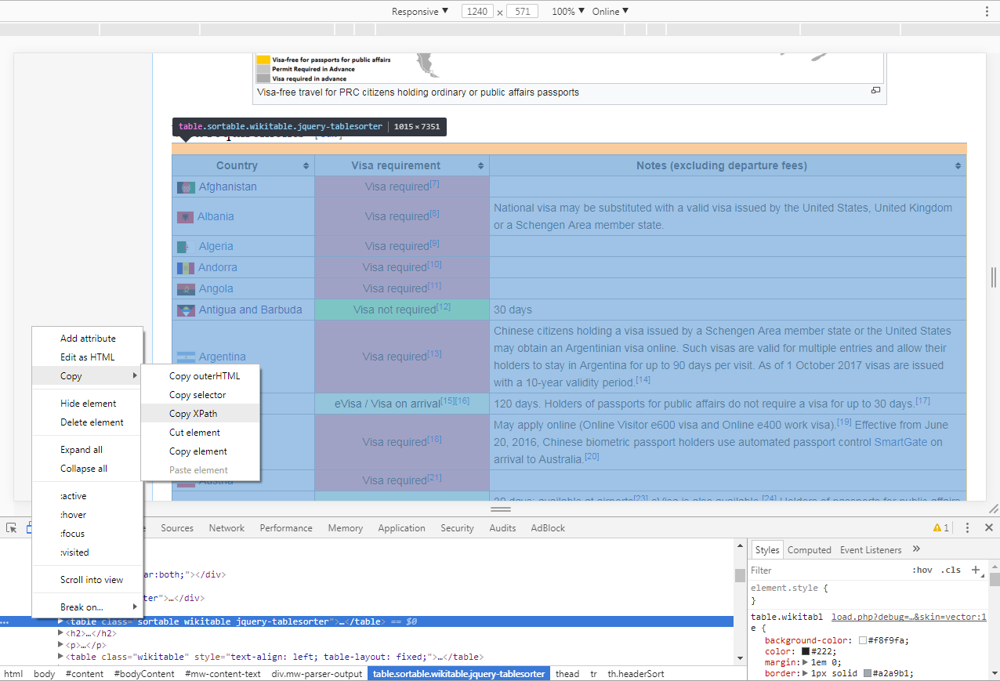

This is my first blog and a tutorial on how to use R to do some simple web scraping and mapping.

It's holiday season now and I was scouting where I could go for a short holiday around Christmas and New Year. I live in the UK and to many Britons this means searching on the Ryanair website and find some place warmer. I wish I could do the same but as a Chinese citizen, I'm not only limited by the thickness of my wallet but also by my Chinese passport. Things have improved over the past few years, but it's still not pack-and-go for us to visit the majority of developed countries. 

Conviniently, there's a [Wikipedia page](https://en.wikipedia.org/wiki/Visa_requirements_for_Chinese_citizens) listing the visa requirements for Chinese citizens for all the countries in the world. It also has a map with countries colour coded with different visa requirements. It looks fine, but who doesn't like a interactive map where you can zoom in/out and get more info about the requirement when you click on the country. So my goal is to plot an interactive world map which shows the countries where I can pack and go at a glance and also provides more infomation for the countries I want to explore in the future.

## Setup

```{r setup, include=FALSE}
knitr::opts_chunk$set(
    echo = TRUE,
    results = TRUE,
    message = FALSE,
    error = FALSE,
    warning = FALSE
)
```

First I need to scrape those tables on Wikipedia and convert them into data frames that are easy to work with in R. To my surprise this is extremely simple to do with the `rvest` package. Now go ahead and install the `rvest` package if you haven't and load some other packages for this analysis.

```{r libraries}

# install.packages("rvest")

library(rvest)
library(dplyr)
library(leaflet)
library(rworldmap)
```

## Web Scraping
Most of the webpages we visit everyday are essentially HTML documents. HTML is short for **HyperText Markup Language**, which, as I understand, is no different to plain text file with a lot tags surrounding the text to tell the browser how it is shown to the user. Therefore it is entirely possible for us to extact only the meaningful text and get rid of the markups if we can figure out the pattern of tags surrounding the text. If you are using Chrome you can inpect the code behind an element of a web page if you right click on the element and click *Inspect*.

See how I can highlight the table I want to scrap when I place my mouse on the corresponding code.


Now you want to right click on the HTML code and *Copy Xpath*.



**That's it!** That's all you need to do locate data and the rest will be done with the `rvest` package.

There are really only three functions that you need to extact the infomation from a table like this. `read_html` reads in the HTML of the website. `html_node` locate the place where you want to extract data. You supply the Xpath you copied previously here. `html_table` converts the HTML table to a neat data frame. 

```{r scraping}

url <- "https://en.wikipedia.org/wiki/Visa_requirements_for_Chinese_citizens"

# table for countries
visa_country <- read_html(url) %>%
    html_node(xpath = '//*[@id="mw-content-text"]/div/table[1]') %>%
    html_table() 
# table for territries
visa_ter <- read_html(url) %>%
    html_node(xpath = '//*[@id="mw-content-text"]/div/table[2]') %>%
    html_table()
# visa for special regions in china
visa_china <- read_html(url) %>%
    html_node(xpath = '//*[@id="mw-content-text"]/div/table[3]') %>%
    html_table()
# bind them together, use mapply to ignore different column names in the df
visa_dat <- mapply(c, visa_country, visa_ter, visa_china) %>%
    as.data.frame() %>%
    mutate_if(is.factor, as.character)
# add an entry for China
visa_dat[NROW(visa_dat) + 1,] <- c("China", "Visa not required", "")

head(visa_dat)

    
```

## Data Cleaning

Now that the web scraping part is done, we can do what we usually do with cleaning the data. For this data, we can first get rid of the ugly citation links. I'd also like to add another column to simply the visa requirement. Visa not required means no hassle at all. Anything with e-visa or visa on arrival should not be a major headache either. The country that requires a visa and is not conditional if you hold a visa of another country requires the most effort in preparation. 

```{r cleaning}
regions <- c("South Atlantic and Antarctica", "South America", "Oceania", 
             "Caribbean and North Atlantic", "Asia", "Africa", "Europe")
visa_dat_clean <- 
    visa_dat %>% 
    setNames(c("country", "visa_req", "notes")) %>%
    filter(!country %in% c("Visitor to", regions)) %>%
    group_by(country) %>%
    summarise(visa_req = paste(visa_req, collapse = ";"),
              notes = paste(notes, collapse = ";")) %>%
    mutate(visa_req = gsub("\\[\\d*\\]", "", visa_req),
           notes = gsub("\\[\\d*\\]", "", notes),
           difficulty = case_when(
               grepl("visa not required", visa_req, ignore.case = TRUE) ~ "no hassle",
               grepl("e-visa|evisa|tourist card|on arrival|registration", visa_req,
                     ignore.case = TRUE) ~ "little hassle",
               grepl("visa required|permit required|pass required|authorisation required|restricted", visa_req, ignore.case = TRUE) & notes == "" ~ "great hassle",
               TRUE ~ "maybe a hassle"
           ))

```

## Plotting

Now we can get into the interesting part of the analysis -- where exactly can I go without any hassle?

First we still need to get the shapefile with all the countries as the basis of the map. We can use the `rworldmap` package to get a world map easily.

```{r load in world polygon}

data("countryExData",envir=environment(),package="rworldmap")
countryExData<-get("countryExData")

countries <- joinCountryData2Map(countryExData, 
                            joinCode = "ISO3", 
                            nameJoinColumn = "ISO3V10")

countries <- sp::merge(countries, visa_dat_clean,
                       by.x = "NAME", by.y = "country")

```

I use `leaflet` to plot the choropleth map here. I learnt it from [RStudio Leaflet for R](https://rstudio.github.io/leaflet/choropleths.html) website.


```{r plot leaflet}

pal <- colorFactor(c("#FF0000", "#FF7F50", "#FFD700", "#00FF00"),
                   countries@data$difficulty)

leaflet(countries) %>%
    setView(0, 0, 2) %>%
    addProviderTiles(providers$CartoDB.Positron) %>%
    addPolygons(popup = paste0("<strong>", countries@data$visa_req, "</strong>", "<br>",
                               "notes: ", countries@data$notes),
                fillColor = ~pal(difficulty),
                weight = 2,
                opacity = 1,
                color = "white",
                dashArray = "3",
                fillOpacity = 0.7) %>%
    addLegend(pal = pal, 
              values = ~ difficulty, 
              opacity = 0.5, title = NULL,
              position = "topright")


```

Looks pretty good. No surprise I need Schengen visa to visit most of the UK neighbours. The closest countries I can visit without any worry are Morocco, Tunisia and Serbia. Ireland is probably OK as well, since I have a UK visa.

